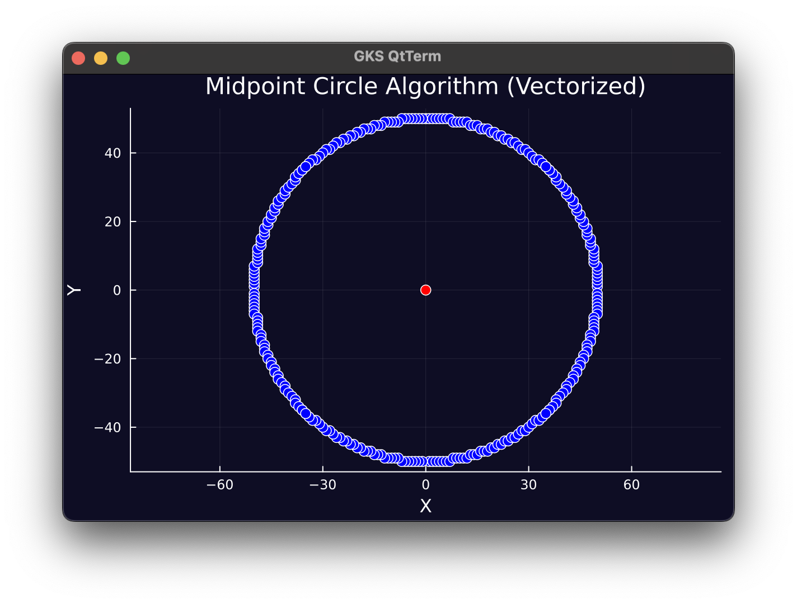
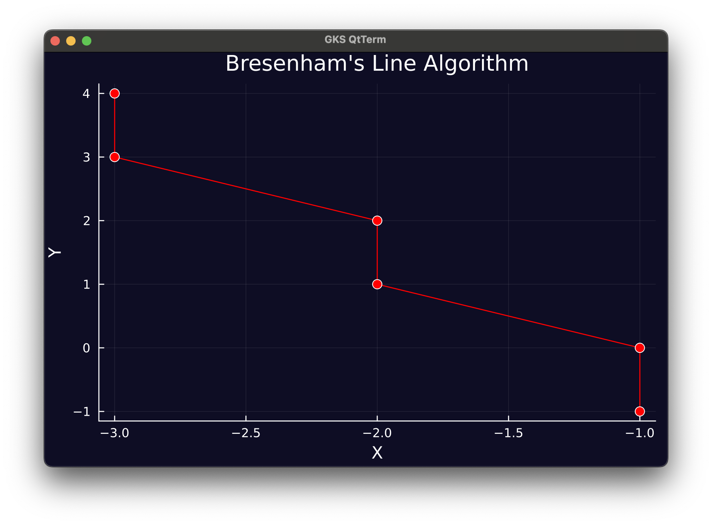

# &nbsp; Julia Playground
Where I Explore and Experiment with Julia Programming Language!

&nbsp;
&nbsp;

## Projects

[Midpoint Circle Algorithm](https://github.com/nsswifter/JuliaPlayground/blob/main/MidpointCircleAlgorithm/MidpointCircleAlgorithm.jl)

[Digital Differential Analyzer Algorithm](https://github.com/nsswifter/JuliaPlayground/blob/main/DigitalDifferentialAnalyzerAlgorithm/DigitalDifferentialAnalyzerAlgorithm.jl)

[Bresenham's Line Algorithm](https://github.com/nsswifter/JuliaPlayground/blob/main/BresenhamLineAlgorithm/BresenhamLineAlgorithm.jl)

